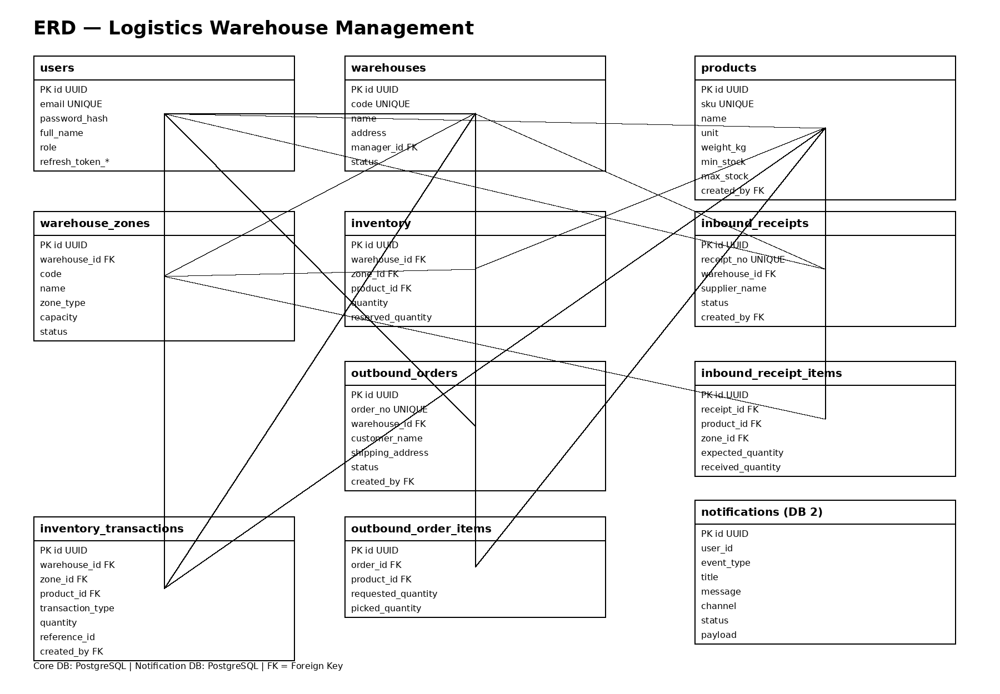

# Logistics Warehouse Management

## 1. Giới thiệu

**Logistics Warehouse Management** là hệ thống quản lý kho logistics, tập trung vào các nghiệp vụ:

- Quản lý kho và khu vực kho.
- Quản lý sản phẩm/SKU.
- Quản lý tồn kho.
- Nhập kho.
- Xuất kho.
- Theo dõi lịch sử biến động tồn kho.
- Quản lý Admin/Super Admin.
- Gửi thông báo thông qua Notification Service.

Thiết kế được xây dựng theo assignment NodeJS/NestJS: 2 backend service gồm **Core Business Service** và **Notification Service**, có CRUD, Redis caching, JWT authorization, SQL database và RabbitMQ.

## 2. Mục tiêu

- Xây dựng RESTful API bằng NestJS.
- Dùng TypeORM để thao tác PostgreSQL.
- Áp dụng JWT authentication/authorization.
- Áp dụng Redis cho caching và rate limiting.
- Tách notification thành service độc lập.
- Dùng RabbitMQ để giao tiếp bất đồng bộ giữa Core Service và Notification Service.
- Có thể triển khai unit test và integration test bằng Jest/SuperTest.

## 3. Kiến trúc

```text
                         ┌───────────────────┐
                         │   Angular Frontend  │
                         └─────────┬─────────┘
                                   │ REST/JSON
                                   ▼
                    ┌─────────────────────────────┐
                    │       Core Service          │
                    │ NestJS + TypeORM + JWT      │
                    │ Warehouse / Product / Stock │
                    │ Inbound / Outbound / Auth   │
                    └──────┬─────────────┬────────┘
                           │              │
                    PostgreSQL           Redis
                           │              │
                           │         Cache/Rate limit
                           │
                           ▼
                     ┌────────────┐
                     │ RabbitMQ   │
                     └─────┬──────┘
                           │
                           ▼
              ┌────────────────────────────┐
              │    Notification Service    │
              │ NestJS + RabbitMQ Consumer │
              └─────────────┬──────────────┘
                            │
                            ▼
                  Notification PostgreSQL
```

Assignment yêu cầu core service gửi mutation events vào RabbitMQ và notification service consume để lưu notification cho subscriber.

## 4. Công nghệ

| Thành phần   | Công nghệ            |
| -------------- | ---------------------- |
| Language       | TypeScript / NodeJS    |
| Framework      | NestJS                 |
| ORM            | TypeORM                |
| DB             | PostgreSQL             |
| Cache          | Redis                  |
| Message Broker | RabbitMQ               |
| Auth           | JWT + password hashing |
| Validation     | Joi / DTO validation   |
| Test           | Jest + SuperTest       |
| Code quality   | ESLint + Prettier      |
| Config         | dotenv                 |

## 5. Domain

### Các entity chính

```text
User
 ├── Warehouse.manager
 ├── Product.createdBy
 ├── InboundReceipt.createdBy
 ├── OutboundOrder.createdBy
 └── InventoryTransaction.createdBy

Warehouse
 ├── WarehouseZone
 ├── Inventory
 ├── InboundReceipt
 ├── OutboundOrder
 └── InventoryTransaction

Product
 ├── Inventory
 ├── InboundReceiptItem
 ├── OutboundOrderItem
 └── InventoryTransaction

InboundReceipt
 └── InboundReceiptItem

OutboundOrder
 └── OutboundOrderItem

Notification
 └── userId
```

## 6. ERD



Sơ đồ thể hiện quan hệ giữa User, Warehouse, Zone, Product, Inventory, Inbound, Outbound, Inventory Transaction và Notification DB.

## 7. Database

File SQL:

**`database.sql`**

SQL được thiết kế cho PostgreSQL, gồm Core DB và Notification DB.

### Core DB

- users
- warehouses
- warehouse_zones
- products
- inventory
- inbound_receipts
- inbound_receipt_items
- outbound_orders
- outbound_order_items
- inventory_transactions

### Notification DB

- notifications

## 8. API / màn hình

Chi tiết từng màn hình và đơn vị chức năng nằm trong:

[README_SCREEN_SPEC.md](README_SCREEN_SPEC.md)

Mỗi chức năng bao gồm:

1. Input.
2. Output.
3. API.
4. Logic API.
5. SQL.
6. Với mutation quan trọng: transaction + Redis invalidation + RabbitMQ event.

Các màn hình chính:

- M01 Login
- M02 Dashboard
- M03 Warehouse
- M04 Warehouse Zone
- M05 Product
- M06 Product CSV Import
- M07 Inventory
- M08 Inventory Transaction
- M09 Inbound Receipt
- M10 Complete Inbound
- M11 Outbound Order
- M12 Picking/Packing/Shipping
- M13 Admin Management
- M14 Super Admin Management
- M15 Logout
- N01 Notification List
- N02 Mark Notification Read
- N03 RabbitMQ Consumer

## 9. Authentication & Authorization

### Roles

```text
SUPER_ADMIN
    │
    ├── Quản lý ADMIN
    ├── Tạo SUPER_ADMIN
    └── Không được delete SUPER_ADMIN

ADMIN
    │
    ├── Xem dữ liệu
    ├── Tạo dữ liệu
    └── Update/Delete dữ liệu thuộc quyền sở hữu
```

### JWT

```text
Login
  ↓
Validate email/password
  ↓
Hash compare
  ↓
Access Token + Refresh Token
  ↓
JWT Guard
  ↓
Role/Ownership Guard
  ↓
Business API
```

## 10. Redis

Áp dụng cache-aside cho các API đọc nhiều:

```text
GET inventory
   ↓
Redis GET
   ├── HIT  → return
   └── MISS
         ↓
       PostgreSQL
         ↓
       Redis SET TTL
         ↓
       return
```

Khi mutation inventory/inbound/outbound thành công:

```text
DB COMMIT
   ↓
Invalidate Redis
   ↓
Publish RabbitMQ
```

Rate limiter được áp dụng theo user/IP để giới hạn request.

## 11. RabbitMQ

### Flow

```text
Core Service
    │
    │ mutation event
    ▼
 RabbitMQ
    │
    │ consume
    ▼
Notification Service
    │
    ▼
notifications table
```

### Event mẫu

```json
{
  "eventType": "OUTBOUND_SHIPPED",
  "actorUserId": "uuid",
  "warehouseId": "uuid",
  "referenceId": "uuid",
  "message": "Đơn xuất đã được giao cho vận chuyển"
}
```

## 12. CSV Import

CSV sản phẩm:

```csv
sku,name,unit,weight_kg,min_stock,max_stock
SKU-001,Product A,PCS,1.2,10,100
SKU-002,Product B,BOX,2.5,5,50
```

Flow:

```text
Upload CSV
   ↓
Parse
   ↓
Validate header
   ↓
Validate từng row
   ↓
Insert transaction
   ↓
Return success/failed rows
```

## 13. Cấu trúc source code

```text
logistics-warehouse/
├── core-service/
│   └── src/
│       ├── auth/
│       ├── users/
│       ├── warehouses/
│       ├── products/
│       ├── inventory/
│       ├── inbound/
│       ├── outbound/
│       ├── dashboard/
│       ├── rabbitmq/
│       ├── redis/
│       └── common/
│
├── notification-service/
│   └── src/
│       ├── notifications/
│       ├── rabbitmq/
│       ├── redis/
│       └── common/
│
├── database.sql
├── erd.png
├── README_SCREEN_SPEC.md
└── README.md
```

## 14. Environment variables

### Core Service

```env
PORT=3000

DB_HOST=localhost
DB_PORT=5432
DB_NAME=logistics_core
DB_USER=postgres
DB_PASSWORD=postgres

REDIS_HOST=localhost
REDIS_PORT=6379

RABBITMQ_URL=amqp://localhost:5672

JWT_ACCESS_SECRET=change_me
JWT_REFRESH_SECRET=change_me
JWT_ACCESS_EXPIRES_IN=15m
JWT_REFRESH_EXPIRES_IN=7d
```

### Notification Service

```env
PORT=3001

DB_HOST=localhost
DB_PORT=5432
DB_NAME=notification_db
DB_USER=postgres
DB_PASSWORD=postgres

REDIS_HOST=localhost
REDIS_PORT=6379

RABBITMQ_URL=amqp://localhost:5672
```

Không commit file `.env` thật lên Git.

## 15. API conventions

### Pagination

```http
GET /api/v1/products?page=1&limit=20
```

### Search

```http
GET /api/v1/products?search=SKU-001
```

### Filter

```http
GET /api/v1/products?status=ACTIVE
```

### Sort

```http
GET /api/v1/products?sortBy=createdAt&sortOrder=DESC
```

## 16. HTTP status

| Status | Trường hợp                     |
| ------ | --------------------------------- |
| 200    | GET/UPDATE thành công           |
| 201    | CREATE thành công               |
| 204    | DELETE thành công không body   |
| 400    | Validation/business input error   |
| 401    | Chưa xác thực                  |
| 403    | Không đủ quyền                |
| 404    | Không tìm thấy                 |
| 409    | Conflict, ví dụ SKU/code trùng |
| 429    | Rate limit                        |
| 500    | Internal server error             |

## 17. Testing

Cần có:

- Unit test Core Service.
- Unit test Notification Service.
- Integration test Core API.
- Integration test Notification API/consumer.
- Test RabbitMQ consumer.
- Jest coverage.

## 18. Các tài liệu đi kèm

| File               | Nội dung                                           |
| ------------------ | --------------------------------------------------- |
| `README.md`      | Tổng quan project, kiến trúc, công nghệ        |
| `erd.png`        | Sơ đồ ERD                                        |
| `database.sql`   | SQL tạo database/schema                            |
| [README_SCREEN_SPEC.md](README_SCREEN_SPEC.md) | Input / Output / API / Logic / SQL từng màn hình |
| [README_CICD_FILES.md](README_CICD_FILES.md) | Hướng dẫn CI/CD và tra cứu các file triển khai |

## 19. Ghi chú triển khai

Thiết kế này cố tình tách **Core Service** và **Notification Service** để đáp ứng yêu cầu message broker và loose coupling. Core chịu trách nhiệm nghiệp vụ kho; Notification Service chỉ chịu trách nhiệm tiếp nhận event và quản lý notification.

Các phần triển khai NestJS/TypeORM cụ thể có thể được phát triển tiếp từ schema và API specification ở trên.
