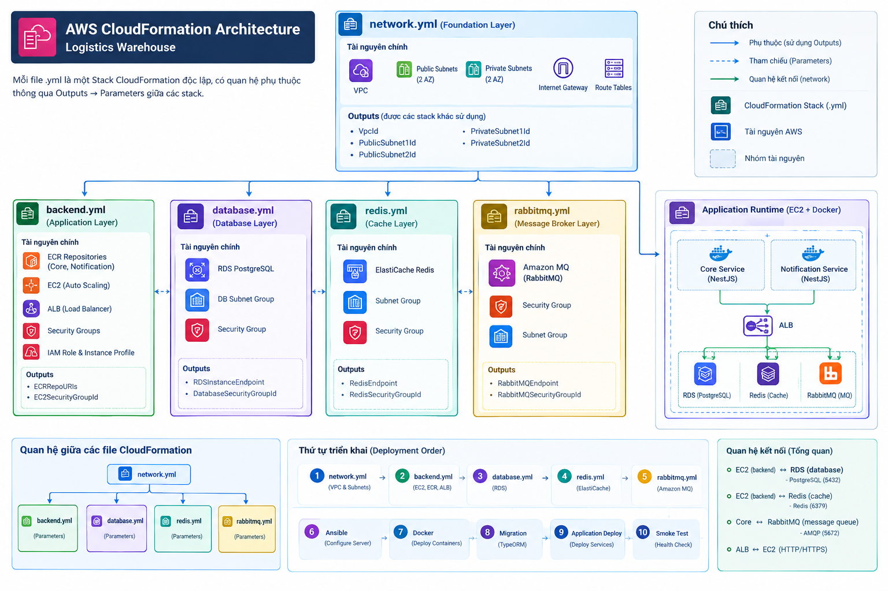

# CI/CD Guide & Files — Logistics Warehouse Backend

## 1. Mục tiêu và kiến trúc

Luồng triển khai backend:

```text
GitLab -> CI/CD -> CloudFormation -> Ansible -> EC2 / Docker
			 -> Migration -> Deploy -> Smoke Test -> Rollback
```

Hệ thống gồm hai NestJS backend services:

- **Core Service** xử lý authentication/authorization, warehouse, zone, product, inventory, inbound/outbound, CSV import, Redis caching và publish RabbitMQ events.
- **Notification Service** consume RabbitMQ events, lưu notification vào database riêng, cung cấp API đọc notification và đánh dấu đã đọc.
- AWS sử dụng ALB, EC2, Docker, ECR, hai database PostgreSQL trên RDS, ElastiCache Redis, Amazon MQ RabbitMQ, CloudFormation, CloudWatch và IAM.

Provision infrastructure trước khi configure server. Migration phải thành công trước khi deploy ứng dụng; smoke test thất bại phải chặn pipeline và kích hoạt rollback.

## 2. Cấu trúc dự án

```text
logistics-warehouse/
|
+-- .gitlab-ci.yml
+-- .gitlab/ci/                 # quality, test, security, build, deploy...
+-- apps/
|   +-- core/                   # NestJS Core Service
|   +-- notification/           # NestJS Notification Service
+-- infra/cloudformation/       # network, backend, database, Redis, RabbitMQ
+-- ansible/
|   +-- inventory/
|   +-- playbooks/              # configure, deploy, rollback
+-- scripts/                    # migration, smoke test, rollback, inventory
+-- docker-compose.prod.yml
+-- package.json
```

## 3. Prerequisites

Local tools: Git, Node.js LTS, Docker, AWS CLI, Ansible và OpenSSH.

AWS cần account và IAM user/role phù hợp, cùng ECR, CloudFormation, EC2, RDS, ElastiCache, Amazon MQ và CloudWatch. GitLab cần repository, GitLab Runner hoặc shared runner và CI/CD Variables.

## 4. GitLab CI/CD Variables và secrets

Tạo variables tại `GitLab > Settings > CI/CD > Variables`:

```text
AWS_ACCESS_KEY_ID
AWS_SECRET_ACCESS_KEY
AWS_DEFAULT_REGION
AWS_ACCOUNT_ID
AWS_STACK_PREFIX
EC2_SSH_PRIVATE_KEY
EC2_HOST
EC2_USER
SSH_ALLOWED_CIDR
API_BASE_URL
PREVIOUS_IMAGE_TAG
DB_PASSWORD
JWT_SECRET
JWT_REFRESH_SECRET
REDIS_PASSWORD
RABBITMQ_PASSWORD
APP_ENV
```

- Đánh dấu secrets là `Masked`; production secrets nên là `Protected` và chỉ cấp cho `main`.
- Không commit `.env`, `.env.production`, AWS credentials, database password, JWT secret hoặc RabbitMQ password.
- Có thể thay static AWS credentials bằng GitLab OIDC và AWS IAM role; secrets cũng có thể lưu trong AWS Secrets Manager.
- Production database không được public Internet. Giới hạn Security Group theo luồng ALB -> EC2 -> RDS/Redis/MQ; chỉ mở SSH từ IP quản trị hoặc dùng AWS Systems Manager.

## 5. Pipeline stages

```text
install -> quality -> test -> security -> build -> provision
				-> configure -> migration -> deploy -> smoke -> rollback
```



| Stage | Mục đích |
|---|---|
| install | Cài dependency bằng `npm ci` |
| quality | ESLint, Prettier và TypeScript checks |
| test | Jest unit tests và SuperTest/integration tests |
| security | `npm audit`, secret detection và security checks |
| build | Build NestJS và Docker images |
| provision | Tạo/cập nhật AWS infrastructure bằng CloudFormation |
| configure | Cấu hình EC2 bằng Ansible và Docker |
| migration | Chạy TypeORM migration; lỗi phải dừng pipeline |
| deploy | Pull/start containers trên EC2 |
| smoke | Kiểm tra `/health` và API |
| rollback | Quay lại image version trước nếu deploy/smoke test lỗi |

Quality, tests, security, build, provisioning, migration, deployment hoặc smoke test thất bại đều phải chặn pipeline.

## 6. Branch và môi trường

```text
feature/* -> Merge Request -> develop -> main -> Production
```

- `feature/*`: install, quality, test, security, build; không deploy production.
- `develop`: CI và tùy chọn deploy môi trường development.
- `main`: chạy đầy đủ pipeline; production secrets chỉ được cấp cho branch được bảo vệ.
- Gắn Docker image bằng Git commit SHA, ví dụ `logistics-core:${CI_COMMIT_SHA}`; không dùng `latest` làm version rollback.

## 7. Local development

```bash
docker compose up -d
docker compose ps
./scripts/migration.sh
./scripts/smoke-test.sh http://localhost:3000
```

## 8. Provision AWS bằng CloudFormation

Các stack gồm `network.yml`, `backend.yml`, `database.yml`, `redis.yml` và `rabbitmq.yml`. Tạo network trước, sau đó provision backend và các dịch vụ phụ thuộc.

```bash
aws cloudformation deploy \
	--stack-name logistics-network \
	--template-file infra/cloudformation/network.yml \
	--capabilities CAPABILITY_NAMED_IAM
```

Các stack còn lại được triển khai theo pipeline.

## 9. Configure EC2 bằng Ansible

```bash
ansible-playbook \
	-i ansible/inventory/production.ini \
	ansible/playbooks/configure-server.yml
```

Ansible cài Docker, đăng nhập ECR, tạo thư mục ứng dụng, chuyển docker-compose/configuration và khởi chạy services. Có thể tách playbook configure, deploy Core và deploy Notification.

## 10. Migration

```bash
./scripts/migration.sh
```

Thứ tự production: Provision -> Configure -> Migration -> Deploy. Migration lỗi thì dừng, không deploy ứng dụng. Không dùng `synchronize: true` hoặc `dropSchema` trên production. Chỉ rollback database khi migration được thiết kế an toàn; destructive changes cần migration strategy riêng.

## 11. Deploy và smoke test

```bash
ansible-playbook \
	-i ansible/inventory/production.ini \
	ansible/playbooks/deploy.yml
```

Deploy flow: EC2 đăng nhập ECR, pull Docker images, chạy `docker compose up -d` và kiểm tra health. Dùng image tag theo `${CI_COMMIT_SHA}` cho cả Core và Notification.

Health endpoint bắt buộc:

```http
GET /health
```

```bash
./scripts/smoke-test.sh https://api.example.com
```

Endpoint phải trả HTTP `200`; nếu không, pipeline fail và chuyển sang rollback strategy.

## 12. Rollback và cleanup

```bash
./scripts/rollback.sh <previous-tag>
```

Hoặc dùng Ansible:

```bash
ansible-playbook \
	-i ansible/inventory/production.ini \
	ansible/playbooks/rollback.yml \
	-e previous_tag=<previous-tag>
```

Sau rollback, chạy lại smoke test. Cleanup có thể xóa temporary files, SSH configuration và deployment artifacts; không tự động xóa production database, Redis data hoặc RabbitMQ configuration.

## 13. Thứ tự triển khai đề xuất

1. Tạo GitLab repository và đưa services vào `apps/core`, `apps/notification`.
2. Chạy PostgreSQL, Redis và RabbitMQ local.
3. Hoàn tất lint, test, build và Docker.
4. Tạo AWS network, RDS, Redis, RabbitMQ và EC2.
5. Configure EC2 bằng Ansible và push Docker images lên ECR.
6. Chạy TypeORM migration, deploy hai services và smoke test.
7. Kiểm thử rollback.

## 14. Definition of Done

- [ ] GitLab pipeline, lint, Prettier, TypeScript build, unit/integration tests và security checks đều PASS.
- [ ] Docker images build và push lên ECR thành công, tag theo commit SHA.
- [ ] CloudFormation provision và Ansible configure thành công.
- [ ] RDS, Redis và RabbitMQ hoạt động; TypeORM migration thành công.
- [ ] Core Service và Notification Service deploy thành công.
- [ ] `/health` trả HTTP 200; smoke test PASS.
- [ ] Logs xuất hiện trên CloudWatch và rollback test thành công.

## 15. Ghi chú trước lần deploy AWS đầu tiên

Đây là deployment skeleton, chưa phải môi trường production hoàn chỉnh. Trước khi deploy:

1. Thay `ami-REPLACE_ME` trong `infra/cloudformation/backend.yml` bằng AMI hợp lệ trong region.
2. Tạo CloudFormation KeyPair và cấu hình `KeyName`.
3. Đặt `SSH_ALLOWED_CIDR` thành IP/CIDR của runner/admin; không để `0.0.0.0/0` trên production.
4. Cập nhật `EC2_HOST`, `EC2_USER` (Amazon Linux thường là `ec2-user`) và `API_BASE_URL` sau khi có EC2/ALB.
5. Đặt `PREVIOUS_IMAGE_TAG` trước khi bật automatic rollback.
6. Đảm bảo EC2 có AWS CLI hoặc cài đặt nó qua Ansible.
7. Nếu build dùng Docker-in-Docker, xác nhận GitLab Runner hỗ trợ.
8. Rà soát IAM, Security Groups, encryption, backups và secret storage.

## 16. Scope assignment 10 ngày

Ưu tiên GitLab CI/CD, Docker, AWS, CloudFormation, Ansible, EC2, RDS PostgreSQL, Redis, RabbitMQ và CloudWatch. Chưa ưu tiên Kubernetes/EKS, Terraform, ArgoCD, Prometheus/Grafana, service mesh, multi-region hoặc blue/green deployment phức tạp.

## 17. CI/CD files quick reference

### GitLab

| File | Trách nhiệm |
|---|---|
| `.gitlab-ci.yml` | Pipeline entry point |
| `.gitlab/ci/quality.yml` | ESLint, Prettier, TypeScript |
| `.gitlab/ci/test.yml` | Unit và integration tests |
| `.gitlab/ci/security.yml` | Security checks |
| `.gitlab/ci/build.yml` | NestJS + Docker build/push |
| `.gitlab/ci/provision.yml` | CloudFormation |
| `.gitlab/ci/deploy.yml` | Ansible, migration, deploy |
| `.gitlab/ci/smoke.yml` | Smoke test |
| `.gitlab/ci/rollback.yml` | Rollback |

### AWS / CloudFormation

| File | Trách nhiệm |
|---|---|
| `network.yml` | VPC, subnets, routes |
| `backend.yml` | EC2, ECR, ALB |
| `database.yml` | RDS PostgreSQL |
| `redis.yml` | ElastiCache Redis |
| `rabbitmq.yml` | Amazon MQ RabbitMQ |

### Ansible và scripts

| File | Trách nhiệm |
|---|---|
| `configure-server.yml` | Cài đặt/cấu hình EC2 |
| `deploy.yml` | Pull images và khởi chạy containers |
| `rollback.yml` | Deploy image version trước |
| `migration.sh` | TypeORM migration |
| `smoke-test.sh` | Kiểm tra `/health` |
| `rollback.sh` | Rollback helper |
| `generate-inventory.sh` | Tạo Ansible inventory |
